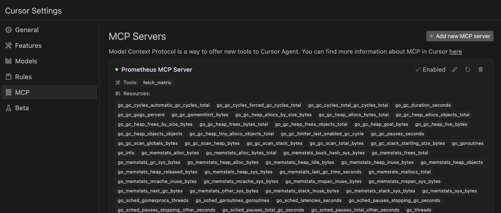

# MCP Server for Prometheus
[](https://smithery.ai/server/@CaesarYangs/prometheus_mcp_server)

A Model Context Protocol (MCP) server for retrieving data from Prometheus databases. This MCP server enables Large Language Models (LLMs) to invoke tool functions that retrieve and analyze vast amounts of metric data, search metric usage, execute complex queries, and perform other related tasks through pre-defined routes with enhanced control over usage.

- Data Retrieval: Fetch specific metrics or ranges of data from Prometheus.
- Metric Analysis: Perform statistical analysis on retrieved metrics.
- Usage Search: Find and explore metric usage patterns.
- Complex Querying: Execute advanced PromQL queries for in-depth data exploration.
- 

## Capibilites

✅ Retrieve comprehensive metric information, including names and descriptions, from Prometheus

✅ Fetch and analyze specific metric data using metric names

✅ Analyze metric data within custom time ranges

🚧 Filter and match data using specific labels (in development)

⏳ Additional features planned...

## Getting Started

MCP runing requires a python virtual environment(venv), all packages should be installed into this venv so the MCP server can be automically started.

### Installing via Smithery

To install Prometheus MCP Server for Claude Desktop automatically via [Smithery](https://smithery.ai/server/@CaesarYangs/prometheus_mcp_server):

```bash
npx -y @smithery/cli install @CaesarYangs/prometheus_mcp_server --client claude
```

### Manual Installation
**Prepare python env**

```sh
cd ./src/prometheus_mcp_server
python3 -m venv .venv
```

```sh
# linux/macos:
source .venv/bin/activate

# windows:
.venv\Scripts\activate
```
Then it is ready to be used as a dedicated python environment.

**Install required packages**

Make sure pip is properly isntalled. If your venv is installed without pip, then manually install it using:
```sh
wget https://bootstrap.pypa.io/get-pip.py
python3 get-pip.py
```

Then install all required packages:
```sh
pip install -r requirements.txt
```

## Usage

### With Cursor Env

Ready to update depend on more easy-to-use Cursor environment.

Set this in the MCP section in Cursor Settings:

```
uv --directory /path/to/prometheus_mcp_server run server.py
```



### With MCP Client(include Claude Desktop)

Config your Claude Desktop app's configuration at `~/Library/Application Support/Claude/claude_desktop_config.json`(macos)

```
{
    "mcpServers": {
        "prometheus": {
            "command": "uv",
            "args": [
                "--directory",
                "/path/to/prometheus_mcp_server",
                "run",
                "server.py"
            ],
            "env": {
                "PROMETHEUS_HOST": "http://localhost:9090"
            }
        }
    }
}
```

### Standalone MCP Server

Started this MCP server alone:

**uv method**

```sh
uv --directory /path/to/prometheus_mcp_server run server.py
```

This is also a way to make sure this MCP server can be automatically started since the Claude Desktop is using this ux script way to start when the app launches.

**regular python method**

```sh
python3 server.py
```

## Contributing

Contributions are welcome! Here's a quick guide:

1. Fork the repo
2. Create your feature branch (`git checkout -b feature/AmazingFeature`)
3. Commit your changes (`git commit -m 'Add some AmazingFeature'`)
4. Push to the branch (`git push origin feature/AmazingFeature`)
5. Open a Pull Request

For major changes, please open an issue first to discuss what you would like to change.

Thank you for your contributions!


## License

MIT License

## References & Acknowledgments

This project was inspired by or uses code from the following open-source projects:

- [Prometheus API Client](https://prometheus-api-client-python.readthedocs.io/en/latest/source/prometheus_api_client.html) - The Prometheus API calling code is modified based on this library
- [MySQL MCP Server](https://github.com/designcomputer/mysql_mcp_server/blob/main/src/mysql_mcp_server) - A similar database oriented MCP server implmentation
